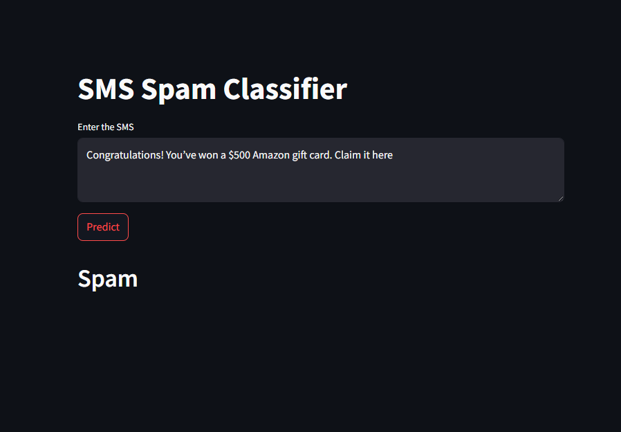

# SMS Spam Classifier

This is a machine learning project that classifies SMS as **"Spam"** or **"Not Spam"**. It uses the **Multinomial Naive Bayes algorithm** and **TF-IDF vectorization** on text data. The app is deployed using **Streamlit** for real-time predictions.


## Live Demo

👉 [Try the App on Streamlit](https://sms-spam-classification-1.streamlit.app/)


## Dataset

- Source: [Kaggle - SMS Spam Collection](https://www.kaggle.com/datasets/uciml/sms-spam-collection-dataset)
- Total messages: 5,572
- Labels: `spam` and `ham`


## Tech Stack

- Python
- Pandas, NumPy
- Scikit-learn
- NLTK (for text preprocessing)
- Streamlit (for UI)


## Project Workflow

1. **Data Loading**: Loaded dataset from Kaggle.
2. **EDA**: Performed Exploratory Data Analysis (EDA) on the dataset.
3. **Text Preprocessing**: Removed stopwords, applied stemming, and cleaned messages.
4. **Feature Extraction**: Used `TfidfVectorizer` to convert text to numeric features.
5. **Model Building**: Trained `Multinomial Naive Bayes` on the vectorized text.
6. **Model Evaluation**: Used classification metrics like accuracy, confusion matrix and precision.
7. **Model Saving**: Created `model.pkl` and `vectorizer.pkl` using pickle.
8. **Deployment**:
   - Built a Streamlit app (`app.py`) for user input and prediction.
   - Created `requirements.txt` for dependencies.
   - Deployed app on Streamlit Cloud.


## How to Run the Project Locally

1. Clone the repo  
```bash
git clone https://github.com/vsuthar10/sms-spam-classification.git
cd sms-spam-classifier
```

2. Install dependencies
```bash
pip install -r requirements.txt
```

3. Run the Streamlit app
```bash
streamlit run app.py
```


## Sample Output




## Future Improvements

- Try other models like Logistic Regression or SVM
- Add advanced text preprocessing (e.g. lemmatization)


## Author

**Vishnu Suthar**  
[LinkedIn](https://www.linkedin.com/in/sutharvishnu/)
